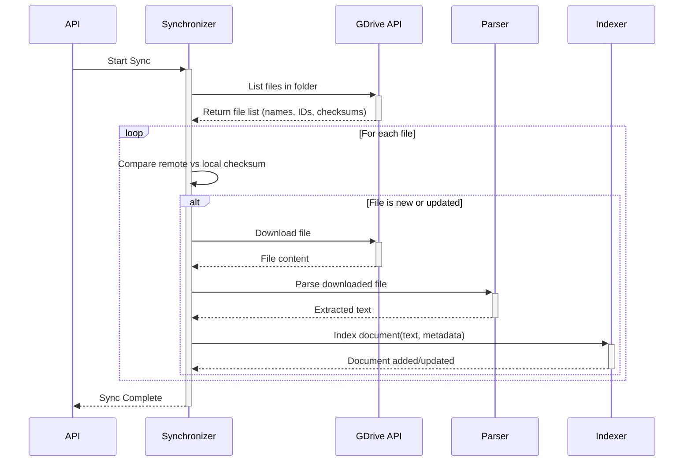
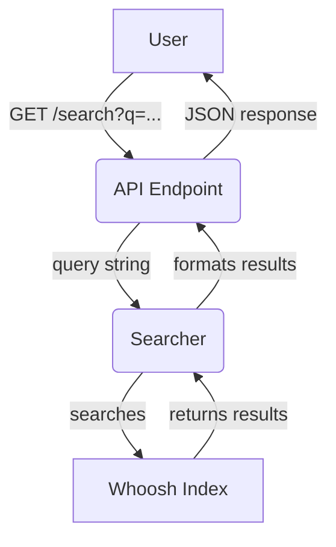

# Katana AI - System Architecture

## 1. Overview

This document outlines the architecture of the Katana AI intelligent search system. The system is designed to scan, analyze, index, and provide a search interface for documents stored in a shared Google Drive folder.

The primary goals of this architecture are:
- **Efficiency:** Minimize resource usage and API calls.
- **Scalability:** Allow the system to grow to handle large volumes of documents and search queries.
- **Reliability:** Ensure the system is robust and can handle failures gracefully.
- **Maintainability:** Create a clean, modular architecture that is easy to understand and extend.

The system is built as a Python application composed of several loosely-coupled modules, exposing its functionality via a REST API.

## 2. Core Modules

The system is divided into the following core modules, each with a distinct responsibility.

### 2.1. Google Drive Integration (`katana.gdrive`)
- **Responsibility:** Handles all communication with the Google Drive API.
- **Components:**
    - `GoogleDriveClient`: A low-level client responsible for authentication (OAuth 2.0) and executing basic API calls like listing files and downloading media.
    - `Synchronizer`: A high-level component that uses the client to synchronize a local directory with a remote Google Drive folder. It maintains a state file (`sync_state.json`) to track file versions (via `md5Checksum`) and only downloads new or updated files.
- **Technology:** `google-api-python-client`

### 2.2. File Parser (`katana.parser`)
- **Responsibility:** Extracts structured text content from various file formats.
- **Components:**
    - `ParserFactory`: A factory that selects the appropriate parser based on file extension.
    - `BaseParser`: An abstract base class defining the common interface for all parsers.
    - Concrete Parsers (`TxtParser`, `PdfParser`, `DocxParser`, etc.): Implementations for specific file types.
- **Technology:** `pypdf`, `python-docx`, standard Python libraries.

### 2.3. Indexer & Searcher (`katana.indexer`)
- **Responsibility:** Manages the full-text search index.
- **Components:**
    - `Indexer`: Responsible for adding, updating, and deleting documents in the search index.
    - `Searcher`: Provides a simple interface for querying the index, returning results with highlighted snippets.
    - `Schema`: Defines the structure of the documents stored in the index (e.g., `doc_id`, `doc_name`, `content`).
- **Technology:** `Whoosh` (a pure-Python search engine library). This was chosen for its simplicity and lack of external dependencies, making it ideal for the initial version.

### 2.4. REST API (`katana.api`)
- **Responsibility:** Exposes the system's functionality to external clients.
- **Components:**
    - `/search` (GET): An endpoint to perform search queries.
    - `/index` (POST): An endpoint to trigger the background indexing process.
- **Technology:** `FastAPI` (for its high performance and automatic documentation generation), `uvicorn` (as the ASGI server).

## 3. Data Flow

The system operates based on two primary data flows: the Indexing Flow and the Search Flow.

### 3.1. Indexing Flow

This flow is responsible for populating and updating the search index. It is triggered by a call to the `/index` API endpoint.

### 3.2. Search Flow

This flow is triggered by a user making a request to the `/search` API endpoint.

## 4. Scalability and Fault Tolerance

While the initial implementation is a single monolithic application, the modular design allows for future scalability and improved fault tolerance.

### 4.1. Scalability
- **API Clustering:** The `katana.api` is stateless and can be run as multiple instances behind a load balancer to handle a high volume of search requests.
- **Index Sharding:** For extremely large document sets, `Whoosh` (and more advanced engines like Elasticsearch) supports index sharding. The index can be split across multiple machines, with the `Searcher` modified to query all shards and aggregate the results.
- **Decoupling Indexing:** The indexing process can be moved to a separate worker process (e.g., using Celery) managed by a message queue (e.g., RabbitMQ). This would prevent long-running indexing tasks from affecting the API's performance.

### 4.2. Fault Tolerance
- **API Retries:** The `GoogleDriveClient` can be enhanced with retry logic (e.g., using an exponential backoff strategy) to handle transient network errors when communicating with the Google Drive API.
- **Graceful Degradation:** The `Searcher` already handles cases where the index does not exist by returning an empty list. This prevents API failures if a search is requested before the first indexing is complete.
- **State Management:** The `sync_state.json` file ensures that if the indexing process is interrupted, it can resume from where it left off without re-downloading all files, saving on API calls and time.

## 5. Technology Choices Rationale

- **Python:** A mature language with a rich ecosystem of libraries for data processing, web APIs, and more.
- **FastAPI:** Chosen for its high performance, modern async capabilities, and excellent developer experience (automatic interactive documentation).
- **Whoosh:** Selected as a lightweight, pure-Python, easy-to-use search library. It avoids the operational overhead of heavier solutions like Elasticsearch or Solr, making it perfect for the initial version of the project. It can be replaced with a more powerful engine as the system's needs grow.
- **Modular Design:** The separation of concerns into `gdrive`, `parser`, `indexer`, and `api` modules makes the system easier to test, maintain, and scale. Each component can be developed and replaced independently.
